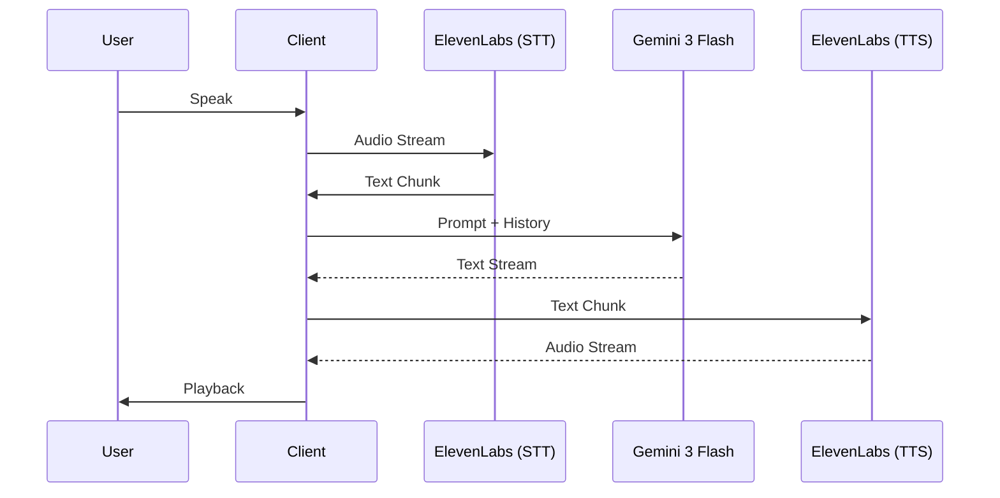

# PRD-002: Voice Interaction and Latency Optimization

## 1. Overview
This document specifies the voice interaction layer, focusing on using ElevenLabs to achieve near-real-time conversational performance.

## 2. Requirements
### 2.1. Speech-to-Text (STT)
- **Provider**: ElevenLabs (or integrated WebSpeech API for initial capture).
- **Mode**: Real-time streaming.
- **Accuracy**: Must handle technical jargon and product-related terminology.
- **Latency**: Sub-500ms for transcription feedback.

### 2.2. Text-to-Speech (TTS)
- **Provider**: ElevenLabs.
- **Model**: Multilingual v2 or Turbo v2.5 for speed.
- **Latency**: Sub-1s response time from LLM text completion to audio playback.
- **Streaming**: Use ElevenLabs WebSocket API to stream audio chunks as they are generated by the LLM.

### 2.3. Conversational UX
- **Interruptibility**: The system must stop speaking immediately if the user begins talking.
- **Voice Activity Detection (VAD)**: Intelligent detection of when the user has finished their thought to trigger LLM processing.
- **Latency Indicators**: Visual cues (e.g., a pulsing orb) to indicate the system is "listening," "thinking," or "speaking."

## 3. Implementation Details
### 3.1. Pipeline Flow

### 3.2. Latency Optimization Strategies
- **WebSocket Tunnels**: Maintain persistent WebSocket connections to both Gemini and ElevenLabs.
- **Chunking**: Send text to ElevenLabs TTS as soon as the first sentence or logical phrase is generated by Gemini.
- **Local VAD**: Run voice activity detection locally on the client to reduce server round-trips for silence detection.

